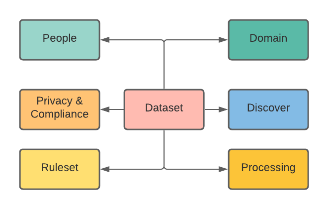
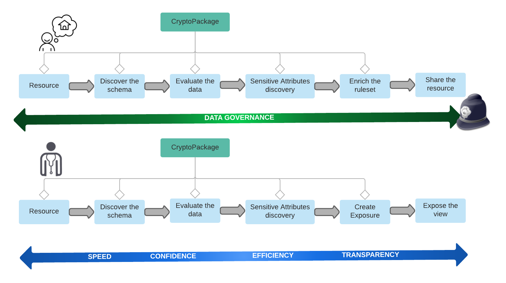

=======
## Crypto Package 
CryptoPackage is data curation and governance framework for privacy and security first data experiences to help data scientists/ml engineers leverage data ethically and legally while helping enterprises enforce internal policies, compliance. CryptoPackage is a framework to describe, analyze,transform and release datasets for ML applications.  


#

Datasets are the files and tables that data practitioners need to find,analyze, transform, enrich and process. They may reside in a data lake, warehouse, master data repository, or any other shared data resource. Dataset metadata describes data relationship attributes like privacy, compliance, schema for data—practitioners, curators, stewards, subject matter experts, etc. 

- People Metadata 
Describes the data—practitioners, curators, stewards, subject matter experts, etc. of the data
- Domain Metadata
Describes the data origin, business context, purpose
- Privacy & Compliance Metadata
Policies associated with data  includes ABAC, PBAC, RBAC
- Discover
Sources, type of data formats, Destinations
- Exposure
Views & features exposed by this dataset in tabular format
- Ruleset
Privacy & governance rules for various exposures of data
## Use Cases

Primary use cases are for ML engineers to bring in data from sources like S3, Kafka and even external sources like SAP, Marketo, Salesforce and build features without worry about privacy compliance.

##CryptoPackage
Today’s business and data practitioners are often working blind, without visibility into the datasets that exist, the contents of those datasets, the sensitiveness of data and the qualities of each. They spend too much time finding and understanding data, often recreating datasets that already exist. They frequently are forced to work with inadequate datasets due to inefficient tooling, not the right governance resulting in inadequate and incorrect analysis. The metadata management benefits of a dataset become apparent by empowering data practitioners with capabilities to understand, data custodians to ensure and data stewards/owners to share the capabilities that are created with comprehensive information. The greatest value, however, is often seen in the impact on analysis activities. We work in an age of self-service analytics. With CryptoPackage data practitioners are quickly able to discover the metadata information of dataset, confidently process and transparently share their data processing.
#

## Actions Available

- **Describe your data**: You can infer, edit and save metadata of your data tables. It's a first step for ensuring data quality and usability. Cryptopackage metadata includes general information about your data like textual description, as well as, field types and other tabular data details.
- **Extract your data**: You can read your data using a unified tabular interface. Data quality and consistency are guaranteed by a schema. Cryptopackage supports various schemes like  S3, FileSystem, DBs and data formats like CSV,  JSON, SQL, and others.
- **Profile your data**: You can read your data using a unified tabular interface. Data quality and consistency are guaranteed by a schema. CrytoPackage provides a dataset extraction, profiling tool.
- **Enrich your data**: You can validate data tables, resources, and datasets. CryptoPackage generates a unified report, as well as supports a lot of options to customize the enrichment process.
- **Expose your data**: You can release datasets as views, features and many in a tabular format.
- **Release your data**: You can clean, reshape, and expose your data tables and datasets. 

## Features

- Open Source (MIT)
- Powerful Python framework
- Convenient command-line interface
- Low memory consumption for data of any size
- Reasonable performance on big data
- Support for compressed files
- Custom checks and formats
- Fully pluggable architecture
- The included API server

## Example

```bash
$ cryptopackage init 
[Name] 
[description]
[package]
[org]
[sourceconfig]

Output: /dataset/{Name}/project.yml
```


```bash
$ cryptopackage describe data/invalid.csv
[invalid] data/invalid.csv

  row    field  code              message
-----  -------  ----------------  --------------------------------------------
             3  blank-header      Header in field at position "3" is blank
             4  duplicate-header  Header "name" in field "4" is duplicated
    2        3  missing-cell      Row "2" has a missing cell in field "field3"
    2        4  missing-cell      Row "2" has a missing cell in field "name2"
    3        3  missing-cell      Row "3" has a missing cell in field "field3"
    3        4  missing-cell      Row "3" has a missing cell in field "name2"
    4           blank-row         Row "4" is completely blank
    5        5  extra-cell        Row "5" has an extra value in field  "5"
```

## Documentation
