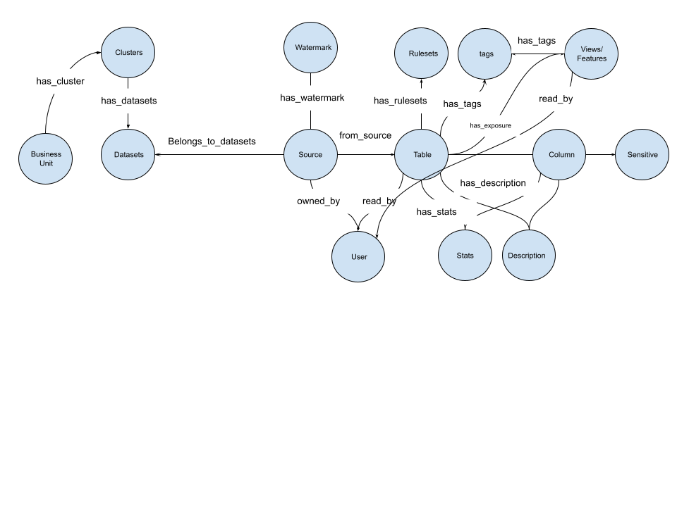

# Tabular data Specifications
A dataset from any source can be seen as tabular resource with sensitive analysis.

## Design Principles
### Simple and readable
* Easy to use for everyone, self contained no need to read extensive documentation
### Extensibility
* Easy to read for everyone
### Reuse 
* Build on existing standards
### Privacy and security
* Empower everyone with privacy and security tools 

## Tabular data spec
Every organization will have the following capabilities defined:

A source as tabular data with exposure:

TODO: ADD RULESETS To views
