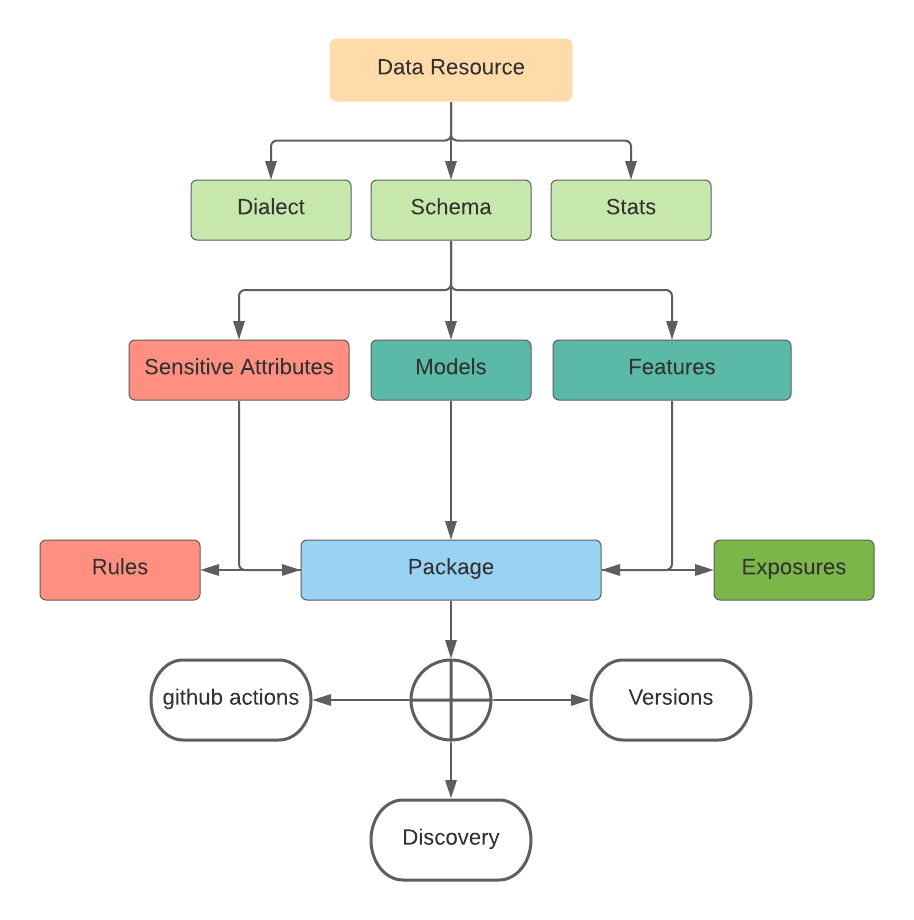

# CryptoPackage Specifications
At the core of CryptoPackage is a set of tools for describing data including DataSet Package (for datasets), Data Resource (source or sources of data) and Table Schema (for tables) and expose them as views with specific privacy and security governance mechanisms. This is a formal specifications of these tools.

## Design Principles
### Simple and readable
* Easy to use for everyone, self contained no need to read extensive documentation
### Extensibility
* Easy to read for everyone
### Reuse 
* Build on existing standards
### Privacy and security
* Empower everyone with privacy and security tools 


## What’s a Crypto Package?
A Crypto Package is a simple container format used to describe and package a collection of data (a dataset) with appropriate privacy analysis.

A crypto package contains:
1. Package definition - crypto_ds.yml
2. Schemas - source or sources,schema.yml + pii information
3. Features - optional features available in the data - *.yml
4. Exposures - *.yml 
4. Policy files with attribute spec, retention spec and security spec - *.rego


## Crypto Package Specs Suite
When you look more closely you’ll see that Crypto Package is actually a suite of specifications. This suite is made of small specs, many of them usuable on their own, that you need to combine together.

#

### Data Resource:
This is the source from which the schema is to be extracted.

With data accessible via the local filesystem.

```javascript
  source: 
    data: "file://resource-path.csv"
```

With data accessible via http.

```javascript 
  source: 
    data: "http://example.com/resource-path.csv"
```

A minimal Data Resource pointing to some inline data looks as follows.

```javascript

  source: 
    data: '{"a": 1, "b": 2}'
    

```

A comprehensive Data Resource example with all required, recommended and optional properties looks as follows.

```javascript
source:
  name: "solar-system"
  data: "http://example.com/solar-system.csv"
  title: "The Solar System"
  description: "My favourite data about the solar system."
  format: "csv"
  mediatype: "text/csv"
  encoding: "utf-8"

```


